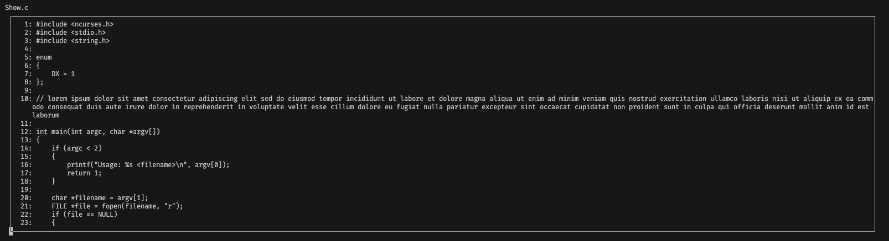

Решение 1 задания по ncurses в базовом варианте задания.

- В верхней части окна отображается название файла
- Выход на клавишу ESC или q
- Длинные строки переносятся, сохраняя при этом нумерацию строк
- Нажатие на пробел показывает следующую строку, если не достигнут конец файла
- Если размер терминала слишком мал, программа завершается

Пример использования:
